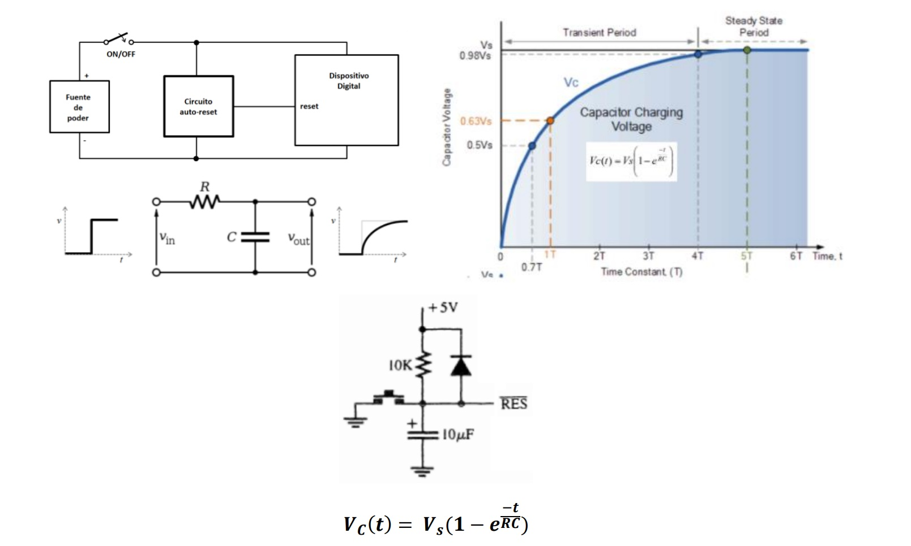
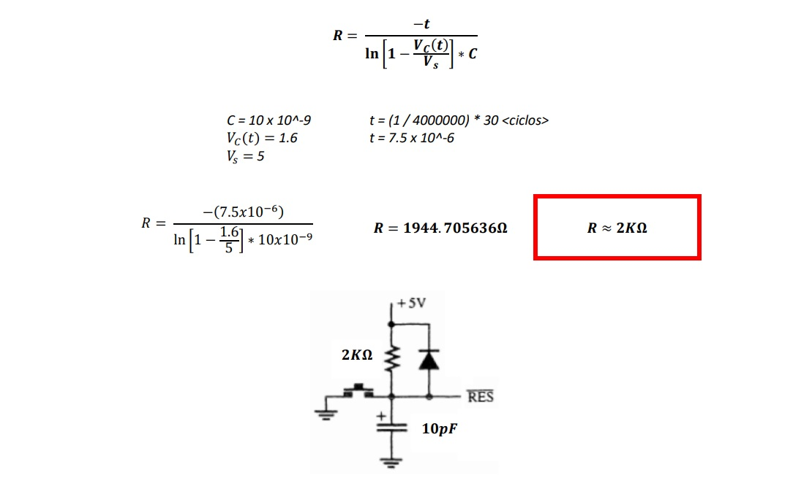

### Un procesador que quiere mínimo 20 ciclos de reloj en su terminal /RESET para inicializarse y que opera a 4MHz. Se determinara un circuito RC apropiado para lograr que dicho procesador logre reconocer la señal de Reset al momento de encender el sistema.

### Se establece el valor del Capacitor para buscar un valor comercial de la resistencia

